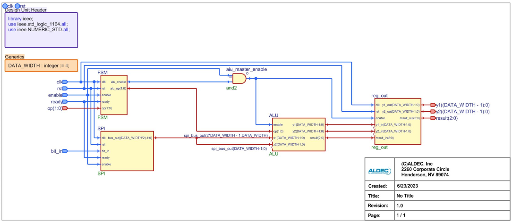
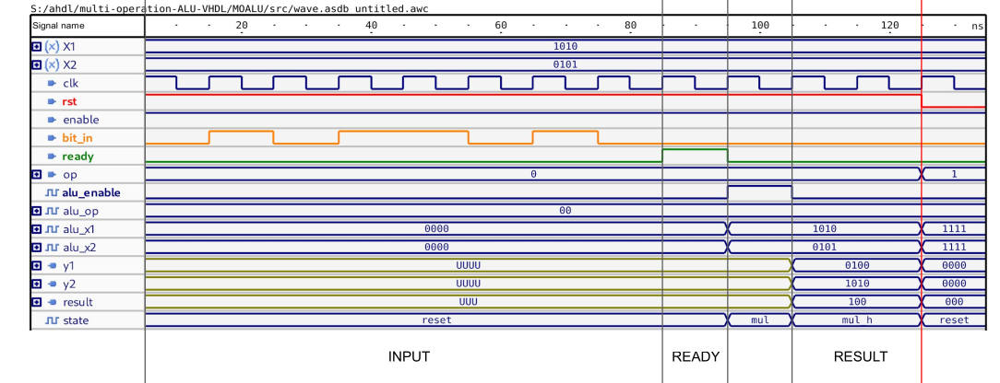
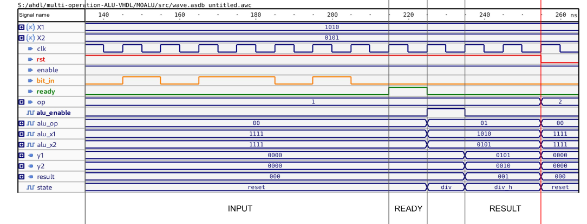
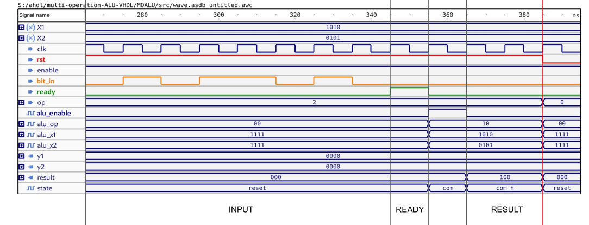

# Multi Operation ALU

**Table of Contents**

- [Multi Operation ALU](#multi-operation-alu)
    - [Introduction](#introduction)
    - [Operation](#operation)
    - [Implementation](#implementation)
    - [Results](#results)
        - [Multiplication by 2](#multiplication-by-2)
        - [Division by 2](#division-by-2)
        - [Comparison](#comparison)

## Introduction
The Multi-Operation ALU (MOALU) project consists of a central unit
(logic-arithmetic, ALU) that performs the following operations on two Nb-bit
numbers A and B:
- Multiplication by 2 of both numbers
- Division by 2 of both numbers
- Comparison (A > B)

The numbers A and B are synchronously acquired on an SPI-like interface on the
rising edge of the clock through the `bit_in` line. Once the acquisition is
complete, the `ready` signal must be set to 1 for the next rising clock period.
Both numbers are then saved in the internal `reg_in` register.

The MOALU is controlled by a 2-bit input signal (S1, S0) that selects the
operation to be performed as shown in the following table:

| S1 | S0 | Operation           |
|----|----|---------------------|
| 0  | 0  | Multiplication by 2 |
| 0  | 1  | Division by 2       |
| 1  | 0  | Comparison (A > B)  |
| 1  | 1  | Not used            |

## Operation
The system operates through a Finite-State-Machine (FSM) Control Unit (CU)
regulated by the control_bits signal (consisting of Mb bits).

The MOALU system is equipped with the following features:
- A global asynchronous low-active reset signal that initializes the content of
  the `reg_in` register by setting all bits to `1`.
- A synchronous high-active enable signal.

## Implementation
The MOALU is implemented in VHDL according to the following schema:

and consists of the following components:
- `moalu.vhd`: top-level entity
- `spi.vhd`: SPI-like input interface
- `alu.vhd`: logic-arithmetic unit
- `mul_div.vhd`: multiplier/divider implemetation
- `comparator.vhd`: comparator implemetation
- `reg_out.vhd`: PIPO output register
- `FSM.vhd`: control unit

Moreover, for each implemented component, a testbench is provided to verify its
correct operation.

## Results
The MOALU has been implemented inside the Active-HDL environment and simulated
using the Active-HDL simulator. The following figures show the operation of the
system two 4-bit numbers A and B: 10 and 5.

### Multiplication by 2

### Division by 2

### Comparison

